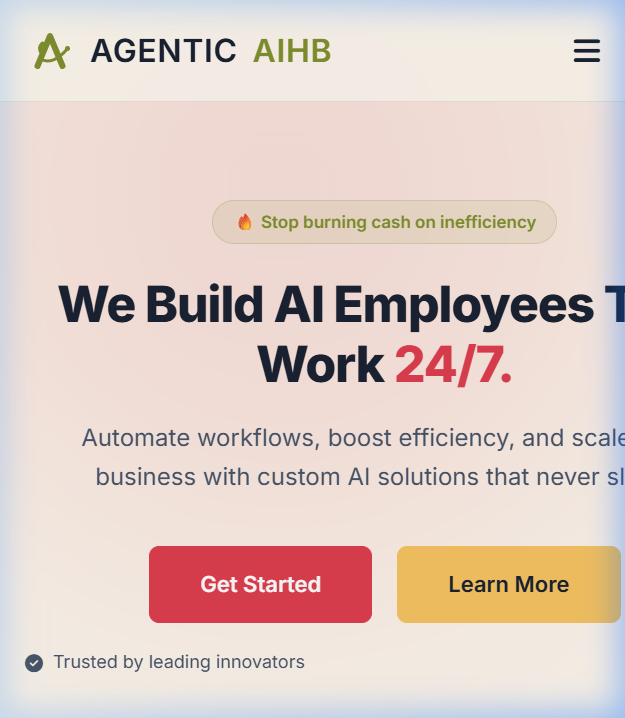
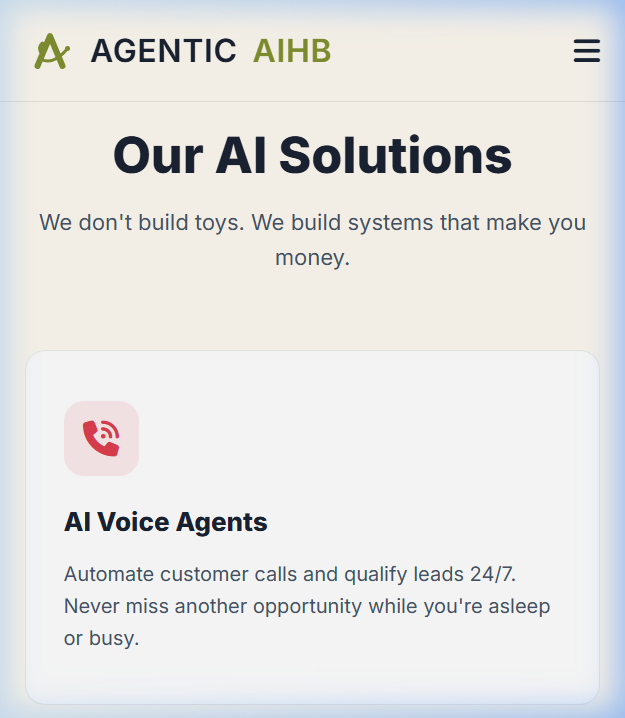

# QA Mobile Walkthrough Report

## Test Summary
- **Date**: 2026-05-06
- **Auditor**: @QA
- **Project**: Agenticaihb Landing Page
- **Device Emulation**: iPhone SE (375x667), iPhone 12 Pro (390x844), iPhone 11 Pro Max (414x896)

## Findings

### 1. Visual Issues (Mobile)
- **[CRITICAL] Headline Overflow**: The main H1 headline ("We Build AI Employees That Work 24/7.") does not scale down on 375px and 414px viewports. It extends beyond the screen width, causing a horizontal scrollbar.
- **[CRITICAL] FAQ Title Clipping**: The "Frequently Asked Questions" H2 title overflows the viewport on 375px screens.
- **Service Cards**: The service card layout becomes very narrow on 375px, making the text feel cramped.

### 2. Functional Issues
- **[CRITICAL] Calendly Embed**: The booking widget failed to load during the test session, leaving a large white space in the CTA section. This might be due to a script loading error or container height issue.

### 3. Responsive Checklist
- [x] Navigation Menu (Sticky)
- [ ] Typography Scaling (FAILED - H1/H2 overflow)
- [x] FAQ Accordion (Logic works, but title clips)
- [ ] Calendly Integration (FAILED to load)
- [x] Footer (Responsive)

## Visual Evidence
Captured at 375x667 viewport:

### Hero Section (Headline Overflow)

### Services Section

## Conclusion
**STATUS: FAILED.**
The mobile experience is currently broken due to typography scaling issues and the Calendly widget failure. 

### Recommendations for @Developer:
1. Use `clamp()` or media queries to reduce `font-size` for H1/H2 on screens smaller than 768px.
2. Add `overflow-wrap: break-word` or `hyphens: auto` to headlines.
3. Investigate the Calendly widget container. Ensure the script is correctly initialized and the parent container has a defined height.
4. Adjust padding/margin on service cards for narrow viewports.

**Handoff: Returning to @Developer.**
