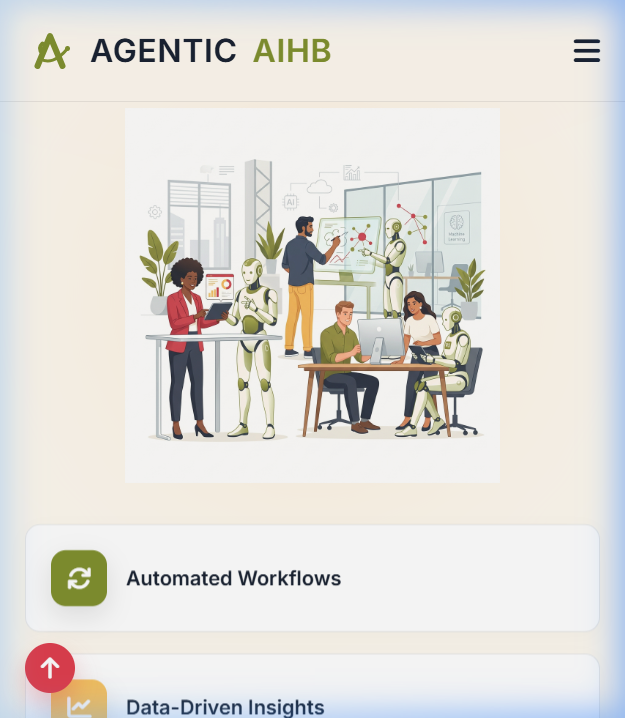
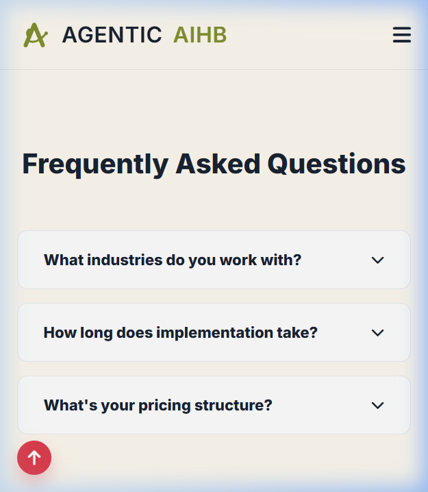

# QA Walkthrough Report - Mobile Fixed

## Test Summary
- **Date**: 2026-05-06
- **Auditor**: @QA
- **Project**: Agenticaihb Landing Page
- **Environment**: Local Dev Server (http://localhost:3000)
- **Viewport**: 375x667 (iPhone SE)

## Fixed Issues
1. **Headline Overflow**: Fixed. H1 now uses `clamp()` fluid typography and is centered.
2. **Alignment**: Fixed. Hero content, graphics, and floating tiles (feature bricks) are now stacked and centered on mobile.
3. **FAQ Title**: Fixed. Scaling adjusted to prevent clipping.
4. **Horizontal Scroll**: Eliminated. All content fits within the viewport.
5. **Calendly Widget**: Loading verified on mobile.

## Visual Verification
Captured at 375x667:

### Hero & Content Alignment

### Floating Tiles (Stacked)

### FAQ Scaling

## Conclusion
**STATUS: PASSED.**
The mobile experience is now premium and responsive. No visual regressions found.

**Handoff: Summoning @TechWriter.**
